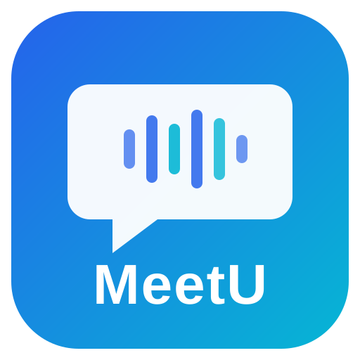

<p align="center">
  
</p>

<h1 align="center">MeetU / 开会啦</h1>

<p align="center">
  <strong>Your AI Meeting Assistant / 你的会议 AI 秘书</strong>
</p>

<p align="center">
  <a href="https://github.com/jessecu2024/MeetU/actions/workflows/ci.yml"></a>
  
  
  
  
</p>

---

## What is MeetU?

MeetU is a cross-platform desktop app that sits beside your meeting window, providing real-time transcription, translation, and AI-powered assistance — all using **your own API keys** (BYOK). Your data never touches our servers.

## Features

| Feature | Description |
|---------|-------------|
| 🎙️ **Real-time Transcription** | Live speech-to-text with speaker identification and multi-language support |
| 🌐 **Live Translation** | Automatic EN↔中 translation with custom glossary support |
| 🔔 **@Mention Detection** | Instantly alerts you when someone calls your name or asks you a question |
| 💡 **Smart Speech Suggestions** | AI generates 3 reply strategies (conservative / assertive / diplomatic) when you're @'d |
| 📋 **Real-time Summary** | Key points, decisions, and action items extracted every few minutes |
| 📄 **Meeting Minutes Export** | Structured minutes auto-generated on meeting end, exportable as Markdown, Word (.docx), or PDF (rendered via Electron/Chromium — CJK included) |
| 🕘 **Meeting History & Search** | Browse past meetings and full-text-search across all their transcripts; open any meeting's full transcript; delete meetings. All local (SQLite). |

## How It Works

```
┌────────────────┐    ┌──────────────┐    ┌────────────────┐
│ Audio Input    │───>│ STT Engine   │───>│ AI Provider    │
│ (Mic or system │    │ (Your Key)   │    │ (Your Key)     │
│  loopback)     │    │              │    │                │
└────────────────┘    └──────┬───────┘    └───────┬────────┘
                             │                     │
                        Transcript            Translation
                        + Captions          + Summary + Tips
                             │                     │
                             └─────────┬───────────┘
                                       │
                             ┌─────────▼─────────┐
                             │  Local SQLite DB   │
                             │  (Your device only)│
                             └───────────────────┘
```

> **Audio capture today:** MeetU offers two recording paths. (1) Microphone or loopback device via `getUserMedia` — pick any audio input including Windows Stereo Mix or a macOS virtual audio cable. (2) **Native system-audio capture** — driverless, no GPL components. On Windows 10+ this uses Electron's `getDisplayMedia` + `audio:'loopback'` (WASAPI loopback, whole-system). On macOS 13+ it uses a native Objective-C++ N-API module that calls Apple's ScreenCaptureKit directly, supporting **both whole-system AND per-application capture** (record only Zoom, etc.). Settings → Audio → "System Audio (native loopback)". macOS requires granting *Screen & System Audio Recording* permission in System Settings. (Note: the macOS native module compiles, loads, and lists capturable apps in CI; end-to-end audio quality should be validated on a machine with the permission granted.)

**Key architecture principles:**
- **BYOK (Bring Your Own Key)** — You use your own AI & STT API keys. We never see them.
- **Local-first** — Audio, transcripts, and settings stored on your device only.
- **Zero GPL** — All dependencies are commercially safe (MIT/BSD/Apache-2.0).
- **Offline STT available** — A cloud STT key OR the offline Local Whisper engine (whisper.cpp, MIT, no key) can drive live transcription. AI features still need your own AI key.

## Supported Providers

### AI Providers

| Provider | Region | Models |
|----------|--------|--------|
| Claude (Anthropic) | Global | Sonnet 4, Haiku 4.5, Opus 4.6 |
| OpenAI GPT | Global | GPT-4o, GPT-4o Mini, o3-mini |
| Google Gemini | Global | Gemini 2.0 Flash, Gemini 2.5 Pro |
| DeepSeek | Global + China | DeepSeek-V3, DeepSeek-R1 |
| Qwen (Alibaba) | Global + China | Qwen Plus, Turbo, Max |
| MiniMax | China | MiniMax-Text-01 |
| Zhipu GLM | China | GLM-4 Flash, GLM-4 Plus |

### STT Engines

| Engine | Region | Type | Status |
|--------|--------|------|--------|
| Deepgram | Global | Real-time WebSocket | ✅ Stable |
| Whisper API (OpenAI) | Global | Segment-based REST (~5s) | ✅ Stable |
| iFlytek | China | PCM streaming WebSocket | ✅ Stable |
| Local Whisper | Offline | whisper.cpp via smart-whisper (MIT) | 🟡 Beta — transcription core verified end-to-end; one-time model download |

> Alibaba Speech (Paraformer) was previously listed but has been removed from the codebase until a real implementation lands.

## Quick Start

### Prerequisites

- **macOS 13+** or **Windows 10+**
- **Node.js 18+**
- Live transcription uses one of four engines: three cloud BYOK engines — Deepgram (streaming, best for English), OpenAI Whisper API (5-second segments, 99 languages), iFlytek (PCM streaming, best for Mandarin/dialects) — or **Local Whisper** (offline whisper.cpp, no key, one-time model download). Without any configured engine, the app falls back to a demo / mock transcript.
- At least one AI provider API Key (e.g., DeepSeek, OpenAI, Claude) — required for translation, summarization, and speech suggestions. Without one, only the raw recording + STT transcript will work.

### Installation

```bash
git clone https://github.com/jessecu2024/MeetU.git
cd MeetU
npm install
npm run dev
```

### Build

```bash
npm run build              # Build for current platform
npm run electron:build     # Build for macOS + Windows
```

## Privacy & Security

MeetU is designed with privacy as a core principle:

- **Local storage on your device** — recordings (`.webm`), transcripts (SQLite), settings, and encrypted API keys are persisted on your machine only
- **Outbound traffic, only to providers you choose**:
  - Live transcription: audio goes directly from your device to the STT provider you configure — streamed (Deepgram), in 5-second segments (OpenAI Whisper API), or PCM-streamed (iFlytek). **Local Whisper runs fully on-device — no audio leaves your machine.**
  - AI features: the relevant transcript text is sent to the AI provider you configure (Anthropic, OpenAI, DeepSeek, etc.)
- **API keys are encrypted** at rest using your OS's secure storage (Electron safeStorage). They are never sent to MeetU (we run no servers); they are only sent directly to the provider you configured, attached as the auth credential on requests to that provider's API
- **No MeetU servers** — we operate no backend, run no telemetry, no analytics, no tracking. Network traffic only ever goes between your device and the third-party providers you select.
- **Source code is auditable** — you can verify exactly what the app does

## Legal Notice

MeetU is a **personal note-taking tool**. Users are responsible for complying with local recording laws and obtaining participant consent where required. See [LEGAL_NOTICE.md](LEGAL_NOTICE.md) for full details.

## License

MeetU is licensed under the **Business Source License 1.1**. See [LICENSE](LICENSE) for the full text.

**In short:**
- Personal, educational, and internal company use: **Free**
- Building a competing commercial product: **Requires a commercial license**
- After 2029-03-19: **Automatically becomes MIT** (fully open source)

See [LICENSE-FAQ.md](LICENSE-FAQ.md) for details.

## Contributing

We welcome contributions! Please note:

1. By submitting a PR, you agree that your contribution is licensed under the same BSL 1.1 terms
2. For significant contributions, we may ask you to sign a Contributor License Agreement (CLA)
3. Please open an issue first for large changes to discuss the approach

## Roadmap

- [x] Local Whisper (whisper.cpp via smart-whisper) — fully offline STT, on-device model
- [x] Windows 10+ system-wide audio loopback (WASAPI via Electron `getDisplayMedia`)
- [x] macOS 13+ system-wide AND per-application audio capture (native ScreenCaptureKit Objective-C++ N-API module)
- [ ] Multi-language support beyond EN/中 (Japanese, Korean, etc.)
- [x] Meeting history browser with transcript search
- [ ] Plugin system for custom AI workflows
- [ ] Mobile companion app for meeting review

## Contact

- GitHub Issues: [github.com/jessecu2024/MeetU/issues](https://github.com/jessecu2024/MeetU/issues)
- Email: meetu.app@outlook.com

---

# 中文文档

## MeetU 是什么？

MeetU（开会啦）是一款跨平台桌面应用，在你开会时提供实时转写、翻译和 AI 辅助功能。采用 BYOK 模式（自带 API Key），你的数据完全不经过我们的服务器。

## 核心功能

| 功能 | 说明 |
|------|------|
| 🎙️ **实时转写** | 语音实时转文字，支持说话人识别和多语言 |
| 🌐 **实时翻译** | 中英自动互译，支持自定义术语表 |
| 🔔 **@检测提醒** | 有人叫你名字或向你提问时立即提醒 |
| 💡 **智能发言建议** | 被@时 AI 自动生成 3 种回复方案（保守/积极/外交） |
| 📋 **实时摘要** | 每隔几分钟自动提取要点、决策和待办事项 |
| 📄 **会后纪要导出** | 会议结束自动生成结构化纪要，可导出为 Markdown、Word (.docx) 或 PDF（经 Electron/Chromium 渲染，中文正常显示） |
| 🕘 **会议历史与搜索** | 浏览历史会议、跨所有会议全文搜索转写内容、查看单场完整转写、删除会议。全部本地（SQLite）。 |

## 工作原理

```
┌──────────────────┐    ┌──────────────┐    ┌────────────────┐
│  音频输入         │───>│  STT 引擎    │───>│  AI 提供商     │
│ （麦克风或系统     │    │ （你的 Key）  │    │ （你的 Key）   │
│   loopback）     │    │              │    │                │
└──────────────────┘    └──────┬───────┘    └───────┬────────┘
                               │                     │
                           转写文本              翻译 + 摘要
                           + 字幕              + 发言建议
                               │                     │
                               └─────────┬───────────┘
                                         │
                               ┌─────────▼─────────┐
                               │   本地 SQLite 数据库 │
                               │  （仅存储在你的设备） │
                               └───────────────────┘
```

> **当前音频捕获说明：** 应用支持两种录音路径。(1) 通过 `getUserMedia` 捕获你选择的音频输入设备 —— 麦克风、Windows 立体声混音、或 macOS 虚拟音频线缆。(2) **原生系统音频捕获**（免驱动、零 GPL）：Windows 10+ 走 Electron `getDisplayMedia` + `audio:'loopback'`（内部 WASAPI loopback，整机捕获）；macOS 13+ 走原生 Objective-C++ N-API 模块直调 Apple ScreenCaptureKit，**同时支持整机与按应用捕获**（可只录 Zoom 等单个应用）。设置 → Audio → "System Audio (native loopback)"。macOS 需在 *系统设置 → 隐私与安全 → 屏幕与系统录制* 中授权。（注：macOS 原生模块已能编译、加载、列出可捕获应用；端到端音质需在已授权的真机上验证。）

**核心架构原则：**
- **纯 BYOK** — 使用你自己的 AI 和 STT API Key，我们永远看不到它们
- **本地优先** — 音频、转写文本、设置全部仅存储在你的设备上
- **零 GPL** — 所有依赖均为商业安全许可（MIT/BSD/Apache-2.0）
- **离线 STT 已可用** — 实时转写可用云端 STT Key,或离线 Local Whisper 引擎(whisper.cpp,MIT,无需 Key);AI 功能仍需你自己的 AI Key

## 支持的服务商

### AI 提供商

| 提供商 | 地区 | 模型 |
|--------|------|------|
| Claude (Anthropic) | 海外 | Sonnet 4, Haiku 4.5, Opus 4.6 |
| OpenAI GPT | 海外 | GPT-4o, GPT-4o Mini, o3-mini |
| Google Gemini | 海外 | Gemini 2.0 Flash, Gemini 2.5 Pro |
| DeepSeek（深度求索） | 国内外均可 | DeepSeek-V3, DeepSeek-R1 |
| 通义千问（阿里） | 国内外均可 | Qwen Plus, Turbo, Max |
| MiniMax | 国内 | MiniMax-Text-01 |
| 智谱 GLM | 国内 | GLM-4 Flash, GLM-4 Plus |

### 语音识别引擎

| 引擎 | 地区 | 类型 | 状态 |
|------|------|------|------|
| Deepgram | 海外 | 实时 WebSocket | ✅ 稳定 |
| Whisper API (OpenAI) | 海外 | 分段 REST（~5 秒） | ✅ 稳定 |
| 讯飞语音 | 国内 | PCM 流式 WebSocket | ✅ 稳定 |
| 本地 Whisper | 离线 | whisper.cpp via smart-whisper (MIT) | 🟡 Beta — 转写核心已端到端验证;需一次性下载模型 |

> 阿里语音 (Paraformer) 之前列在此处但尚未实现，已从代码中暂时移除，待真正集成后再加回。

## 快速开始

### 前置条件

- **macOS 13+** 或 **Windows 10+**
- **Node.js 18+**
- 实时转写可选四个引擎:三个云端 BYOK —— Deepgram（流式、英文最佳）、OpenAI Whisper API（5 秒分段）、讯飞（PCM 流式、中文最佳）—— 或 **Local Whisper**（离线 whisper.cpp,无需 Key,需一次性下载模型）。未配置任何引擎时退回 demo/mock 转写。
- 至少一个 AI 提供商的 API Key（如 DeepSeek、OpenAI、Claude）— 用于翻译、摘要、发言建议；未配置时仅原始录音 + STT 转写可用。

### 安装

```bash
git clone https://github.com/jessecu2024/MeetU.git
cd MeetU
npm install
npm run dev
```

### 构建发布版

```bash
npm run build              # 为当前平台构建
npm run electron:build     # 为 macOS + Windows 构建
```

## 隐私与安全

MeetU 以隐私为核心设计原则：

- **本地设备存储** — 录音文件（`.webm`）、转写记录（SQLite）、设置和加密后的 API Key 都仅保存在你的本机
- **外发流量，仅发往你自己选择的服务商**：
  - 实时转写：音频从你的设备直接发送至你配置的 STT 服务商 —— 流式（Deepgram）、5 秒分段（OpenAI Whisper API）或 PCM 流式（讯飞）。**Local Whisper 完全在本机运行 —— 音频不出设备。**
  - AI 功能：相关转写文本发送至你配置的 AI 服务商（Anthropic、OpenAI、DeepSeek 等）
- **API Key 使用操作系统级加密** 存储（Electron safeStorage）。它们不会发送给 MeetU（我们没有任何服务器），仅作为请求认证凭据直接发送给你所配置的对应服务商
- **没有 MeetU 服务器** — 我们不运行任何后端，没有遥测、分析或追踪；所有网络流量只发生在你的设备与你选择的第三方服务商之间
- **源码可审计** — 你可以验证应用的每一个行为

## 法律声明

MeetU 是一个**个人笔记辅助工具**。用户有责任遵守当地录音法律并获取参与者同意。详见 [LEGAL_NOTICE.md](LEGAL_NOTICE.md)。

## 许可证

MeetU 采用 **Business Source License 1.1** 许可证。详见 [LICENSE](LICENSE)。

**简而言之：**
- 个人使用、学习研究、企业内部使用：**免费**
- 构建竞争性商业产品：**需要商业许可**
- 2029-03-19 之后：**自动转为 MIT 开源**

详见 [LICENSE-FAQ.md](LICENSE-FAQ.md)。

## 贡献指南

欢迎贡献！请注意：

1. 提交 PR 即表示同意你的贡献遵循相同的 BSL 1.1 条款
2. 对于重大贡献，我们可能会要求签署贡献者许可协议（CLA）
3. 大型改动请先提 Issue 讨论方案

## 路线图

- [x] 本地 Whisper（whisper.cpp via smart-whisper）—— 完全离线转写,本机模型
- [x] Windows 10+ 整机系统音频 loopback（via Electron `getDisplayMedia`，内部 WASAPI）
- [x] macOS 13+ 整机与按应用音频捕获（原生 ScreenCaptureKit Objective-C++ N-API 模块）
- [ ] 更多语言支持（日语、韩语等）
- [x] 会议历史浏览与转写搜索
- [ ] 插件系统，支持自定义 AI 工作流
- [ ] 移动端配套应用，用于回顾会议

## 联系方式

- GitHub Issues: [github.com/jessecu2024/MeetU/issues](https://github.com/jessecu2024/MeetU/issues)
- 邮箱: meetu.app@outlook.com

---

<p align="center">
  <sub>Built with Electron + React + TypeScript. Zero GPL dependencies.</sub>
</p>
